# Sebastian

> *"Under the sea, diagrams are better — down where it's wetter, take it from me!"*

**Sebastian** is a Claude Code plugin that brings interactive, browser-based preview and annotation to [Mermaid](https://mermaid.js.org/) diagrams. Click nodes and edges directly in the browser to leave comments, then watch Claude revise the diagram based on your feedback — all without leaving your workflow.

---

## ✨ What It Does

When you're working with `.mmd` files in Claude Code, Sebastian automatically opens a live preview in your browser. You can:

- 🖼️ **Render** any Mermaid diagram type (flowcharts, sequence diagrams, ER diagrams, class diagrams, state machines, Gantt charts, and more)
- 🖱️ **Click** any node, edge, or actor to attach a comment
- 📤 **Submit** structured feedback that Claude reads and acts on immediately
- 🔁 **Iterate** until the diagram is exactly right

The annotation loop looks like this:

```
Claude writes .mmd file
       ↓
Sebastian opens browser preview
       ↓
You click elements and leave comments
       ↓
Sebastian returns structured feedback to Claude
       ↓
Claude revises the diagram
       ↓
Repeat until perfect
```

---

## 📦 Installation

### Requirements

- [Claude Code](https://claude.ai/claude-code) (CLI)
- Node.js 18+

### Install as a Claude Code Plugin

```bash
# Add the GitHub repository as a marketplace (one-time setup)
claude plugin marketplace add micnoy/sebastian

# Install the plugin
claude plugin install sebastian
```

Claude Code registers the slash commands and hooks automatically. No manual setup required.

### Local Development

To use the plugin from a local checkout without installing:

```bash
git clone https://github.com/micnoy/sebastian.git
claude --plugin-dir ./sebastian
```

### CLI (optional)

To use `sebastian` directly from your terminal, symlink the binary into your PATH:

```bash
# Run from inside the cloned repo
ln -s "$(pwd)/bin/sebastian" ~/.local/bin/sebastian
```

---

## 🚀 Usage

### Slash Commands

Once installed, three slash commands are available inside any Claude Code session:

#### ✏️ `/sebastian:diagram`

Ask Claude to generate a new diagram from a description.

```
/sebastian:diagram  Show me the authentication flow for a JWT-based API
```

Claude picks the right diagram type, writes the Mermaid code, and opens Sebastian for annotation.

#### 👁️ `/sebastian:preview`

Preview and annotate an existing `.mmd` file or a Mermaid code block from your conversation.

```
/sebastian:preview path/to/my-diagram.mmd
```

#### 📁 `/sebastian:folder`

Open a whole folder of `.mmd` files for batch review — navigate between diagrams, annotate each, and submit all feedback at once.

```
/sebastian:folder path/to/diagrams/
```

### ⚡ Automatic Hook

Sebastian also runs automatically. Whenever Claude writes a `.mmd` file via the `Write` tool, the `PostToolUse` hook fires and opens the preview — no manual command needed.

### 🖥️ CLI

If you've set up the optional symlink, you can also run Sebastian directly from the terminal:

```bash
# Preview a specific file
sebastian preview path/to/diagram.mmd

# Auto-detect mode (used by the hook — reads Write event from stdin)
echo '{"tool_input":{"file_path":"diagram.mmd","content":"..."}}' | sebastian auto-detect
```

---

## ⚙️ How It Works

Sebastian runs a lightweight local HTTP server (no external dependencies — pure Node.js built-ins only). When a diagram is ready to preview, it:

1. Starts the server on a random available port
2. Opens your default browser to `localhost:<port>`
3. Serves an interactive HTML/JS UI with the Mermaid diagram rendered
4. Waits for you to annotate and submit feedback
5. Prints structured feedback to stdout for Claude to read
6. Shuts itself down

### Endpoints

| Endpoint | Description |
|---|---|
| `GET /` | The annotation UI |
| `GET /api/diagram` | Returns the Mermaid source as JSON |
| `POST /api/feedback` | Receives annotations, prints to stdout, exits |

### Browser Support

Sebastian auto-detects your platform:
- **macOS**: `open`
- **Linux**: `xdg-open`
- **Windows**: `cmd.exe /c start`

Override with `SEBASTIAN_BROWSER` or `BROWSER` environment variables.

---

## 🎨 Diagram Gallery

Copy any command into Claude Code to generate and annotate that diagram type.

<details>
<summary><strong>📊 Flowchart</strong></summary>

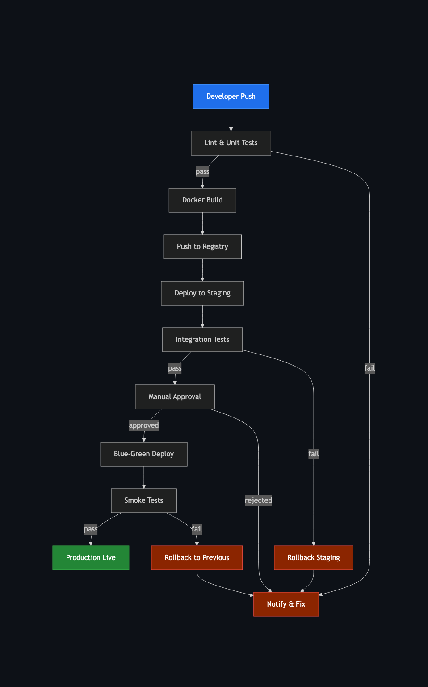

```
/sebastian:diagram CI/CD pipeline from commit to production deploy — trace the full journey from a developer pushing to a feature branch through automated lint and unit tests, Docker image build and registry push, deployment to staging, integration test gate, manual approval step, blue-green production deploy, and post-deploy smoke tests. Branch on test failures with explicit rollback paths back to the previous image.
```

</details>

<details>
<summary><strong>🔄 Sequence Diagram</strong></summary>

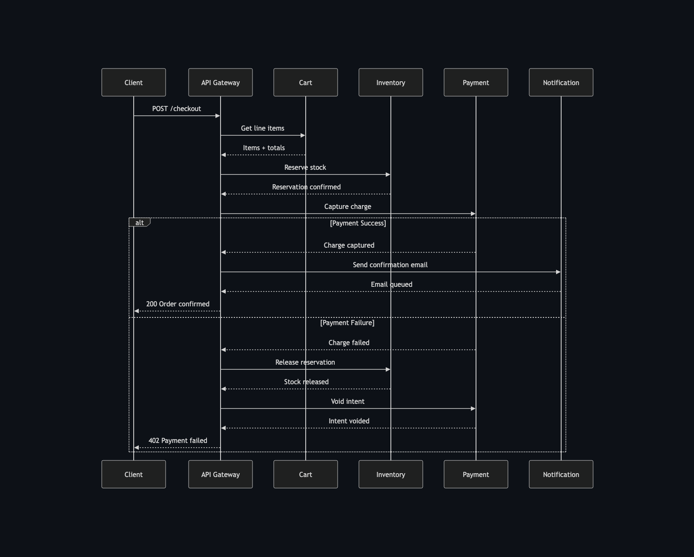

```
/sebastian:diagram Microservices checkout flow: cart, payment, inventory, notification — show how a checkout request is orchestrated across four microservices by an API Gateway: Cart retrieves line items, Inventory reserves stock against the Order DB, Payment captures the charge via the payment provider, and Notification sends the confirmation email. Include the full rollback sequence triggered on payment failure: release the inventory reservation, void the payment intent, and return a structured error to the client.
```

</details>

<details>
<summary><strong>🏗️ Class Diagram</strong></summary>

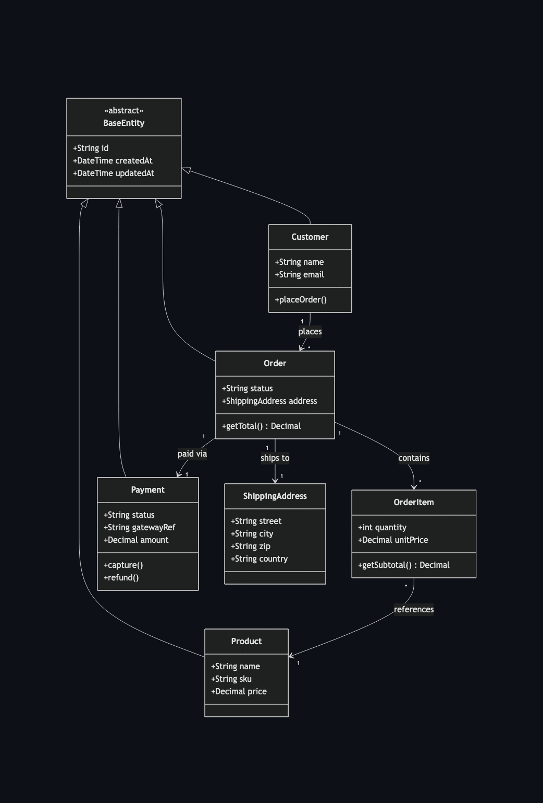

```
/sebastian:diagram E-commerce domain model: Product, Order, Customer, Payment — model a full e-commerce core where Customer owns multiple Orders, each Order contains OrderItems linked to Products with quantity and unit price, a Payment is associated with each Order tracking status and gateway reference, and a ShippingAddress is embedded on Order. Show all cardinalities, key attributes, and an abstract BaseEntity with id, createdAt, and updatedAt fields inherited by every entity.
```

</details>

<details>
<summary><strong>🔗 Entity Relationship</strong></summary>

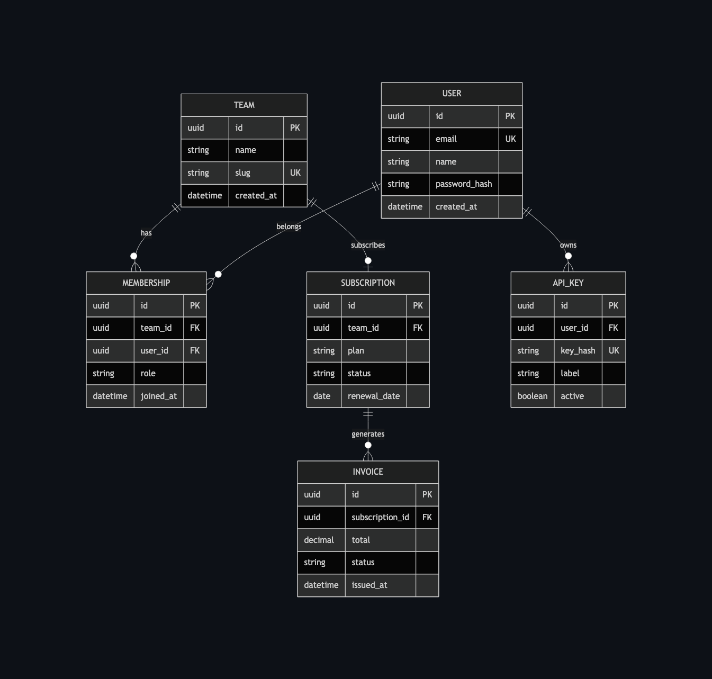

```
/sebastian:diagram SaaS multi-tenant database schema with users, teams, and billing — design a schema where a Team (tenant) has many Users through a Membership join table with a role column, a Subscription belongs to a Team with plan, status, and renewal date, an Invoice belongs to a Subscription with line items and a total, and a User has an ApiKey for service-to-service authentication. Show foreign keys, unique constraints, and nullable columns explicitly.
```

</details>

<details>
<summary><strong>⚙️ State Machine</strong></summary>

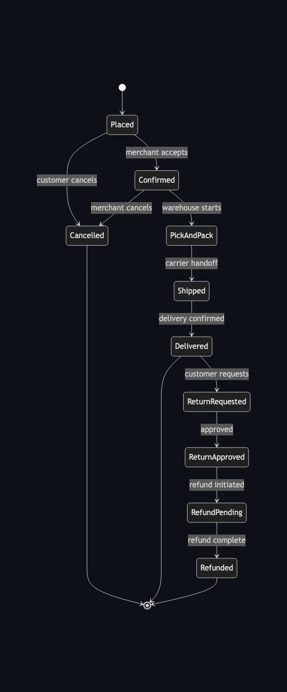

```
/sebastian:diagram Order lifecycle: placed, confirmed, shipped, delivered, returned — model every state an order can reach from placement through merchant confirmation, warehouse pick-and-pack, carrier handoff, successful delivery, and the optional return and refund flow. Include guard conditions on each transition, a cancelled terminal state reachable from placed or confirmed, and a refund-pending intermediate state triggered on return approval.
```

</details>

<details>
<summary><strong>📅 Gantt Chart</strong></summary>

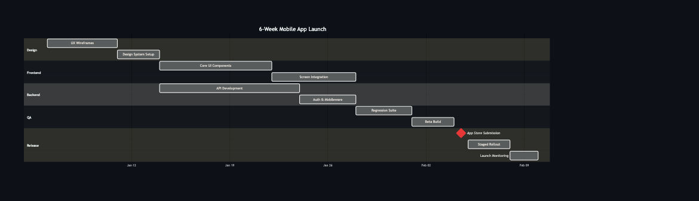

```
/sebastian:diagram 6-week mobile app launch plan with design, dev, QA, and release phases — lay out a timeline starting with UX wireframes and design system setup in week 1, parallel frontend and backend development tracks in weeks 2–4, QA with a regression suite and beta build in week 5, and app store review submission, staged rollout, and launch-day monitoring in week 6. Mark the App Store submission deadline as a milestone and show dependencies between phases.
```

</details>

<details>
<summary><strong>🧠 Mind Map</strong></summary>

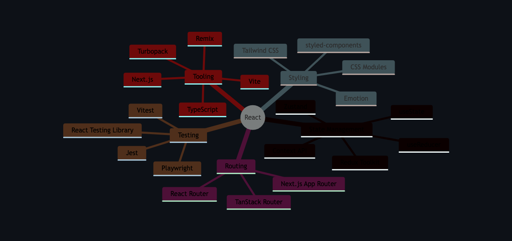

```
/sebastian:diagram Mind map of the React ecosystem: state, routing, styling, testing, tooling — branch from React core into five domains: State Management (useState, useReducer, Context, Zustand, Redux Toolkit), Routing (React Router, TanStack Router, Next.js App Router), Styling (CSS Modules, Tailwind, styled-components, Emotion), Testing (Jest, React Testing Library, Vitest, Playwright), and Tooling (Vite, Next.js, Remix, Turbopack, TypeScript).
```

</details>

<details>
<summary><strong>🌿 Git Graph</strong></summary>

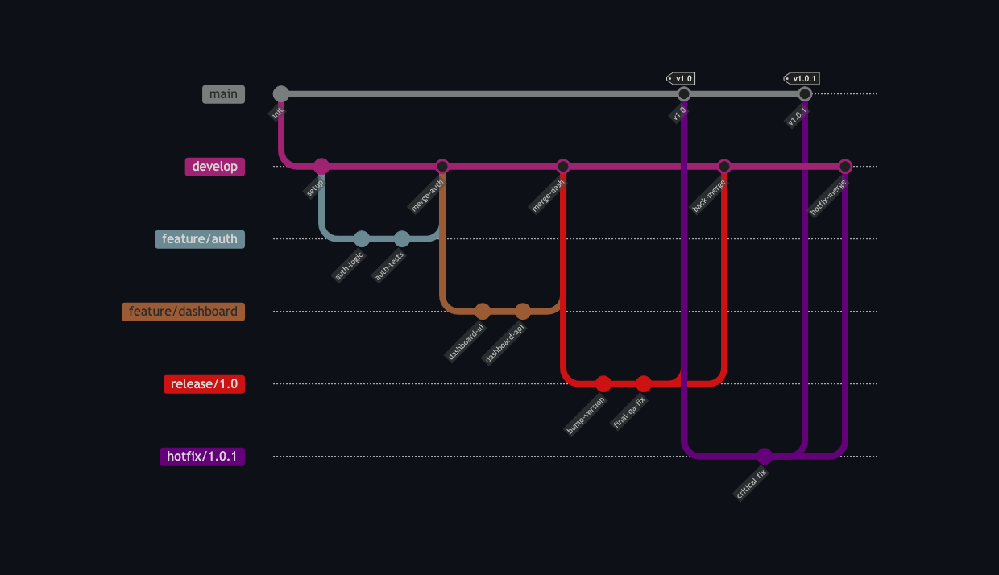

```
/sebastian:diagram Gitflow branching strategy: main, develop, feature branches, hotfix, release — illustrate a complete Gitflow workflow with main and develop as long-running branches, two feature branches forked from develop and merged back via pull request, a release branch cut from develop for final QA with a version-bump commit, that release branch merged into both main and develop on ship, and a hotfix branch forked from main to patch a production bug then merged back into both main and develop.
```

</details>

<details>
<summary><strong>⏳ Timeline</strong></summary>

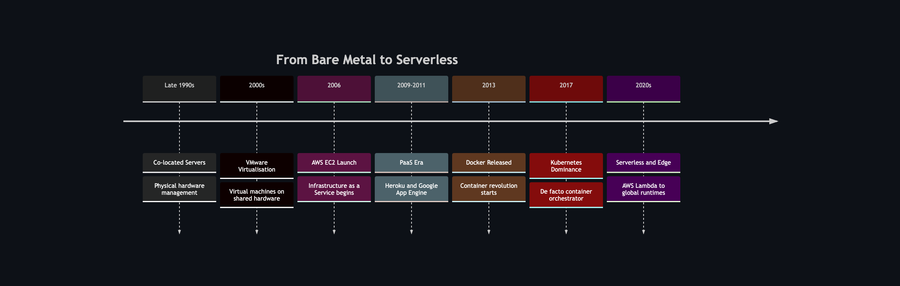

```
/sebastian:diagram Evolution of cloud computing: bare metal to serverless — chart the major eras from co-located bare-metal servers in the late 1990s through VMware-era virtualisation in the 2000s, AWS EC2 and the IaaS wave in 2006, the PaaS era with Heroku and Google App Engine in 2009–2011, Docker and container proliferation from 2013, Kubernetes becoming the de-facto orchestrator by 2017, and the serverless and edge-compute era from AWS Lambda through to today's globally distributed runtimes.
```

</details>

<details>
<summary><strong>🎯 Quadrant Chart</strong></summary>

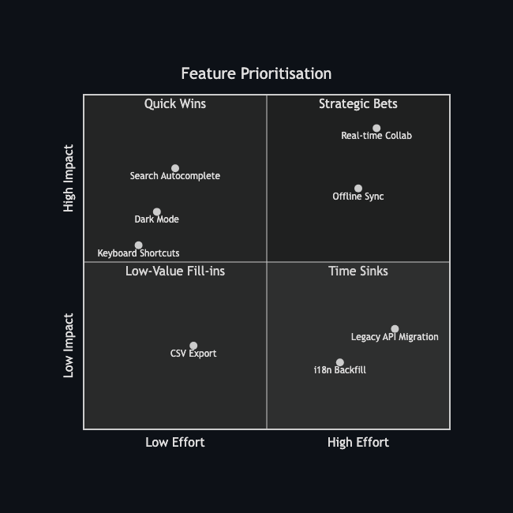

```
/sebastian:diagram Prioritize backlog features by user impact vs implementation effort — place a representative set of product backlog items on a 2×2 matrix with user impact on the Y axis and implementation effort on the X axis. Populate all four quadrants: quick wins such as search autocomplete and dark mode; strategic bets such as real-time collaboration and offline sync; low-value fill-ins such as CSV export; and time sinks such as legacy API migration and i18n backfill.
```

</details>

<details>
<summary><strong>🥧 Pie Chart</strong></summary>

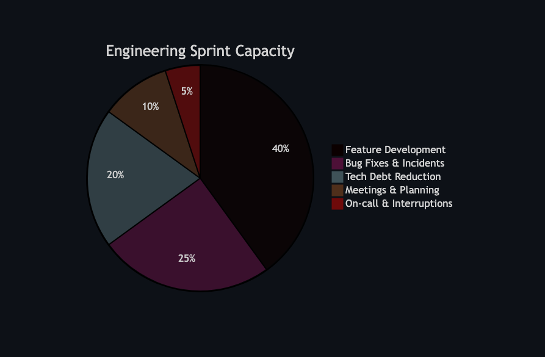

```
/sebastian:diagram Engineering team time split across a two-week sprint — show how sprint capacity is distributed across new feature development (40%), bug fixes and production incidents (25%), planned tech debt reduction (20%), meetings and planning ceremonies (10%), and on-call and unplanned interruptions (5%). Label each slice with both its category name and percentage.
```

</details>

---

## 🗂️ Project Structure

```
sebastian/
├── bin/
│   └── sebastian              # CLI entry point (bash wrapper)
├── server/
│   ├── index.js               # HTTP server + CLI logic (Node.js, no deps)
│   └── ui.html                # Browser UI (vanilla HTML/CSS/JS + Mermaid v11)
├── hooks/
│   ├── hooks.json             # PostToolUse hook registration
│   └── mmd-filter.sh          # Fires on .mmd file writes
├── commands/
│   ├── sebastian-diagram.md   # /sebastian-diagram slash command
│   └── sebastian-preview.md   # /sebastian-preview slash command
├── assets/
│   └── sebastian.png          # Our beloved mascot
└── .claude-plugin/
    ├── plugin.json            # Plugin manifest
    └── marketplace.json       # Marketplace catalog
```

---

## 🔧 Configuration

### Environment Variables

| Variable | Purpose |
|---|---|
| `SEBASTIAN_BROWSER` | Override the browser command (highest priority) |
| `BROWSER` | Fallback browser override |
| `CLAUDE_PLUGIN_ROOT` | Set automatically by Claude Code |

---

## 🦀 Why "Sebastian"?

Because Sebastian the crab from *The Little Mermaid* is the one who keeps things organized, adds the musical flair, and makes sure everything comes together beautifully — just like a good diagram annotation tool should. Also, Mermaid. Obviously.

---

## 💡 Inspiration

Sebastian was inspired by [**plannotator**](https://github.com/backnotprop/plannotator) — a Claude Code plugin for interactive plan annotation. The idea of closing the loop between Claude's output and human feedback directly in the browser came from watching plannotator in action. Go check it out.

---

## 📄 License

MIT
